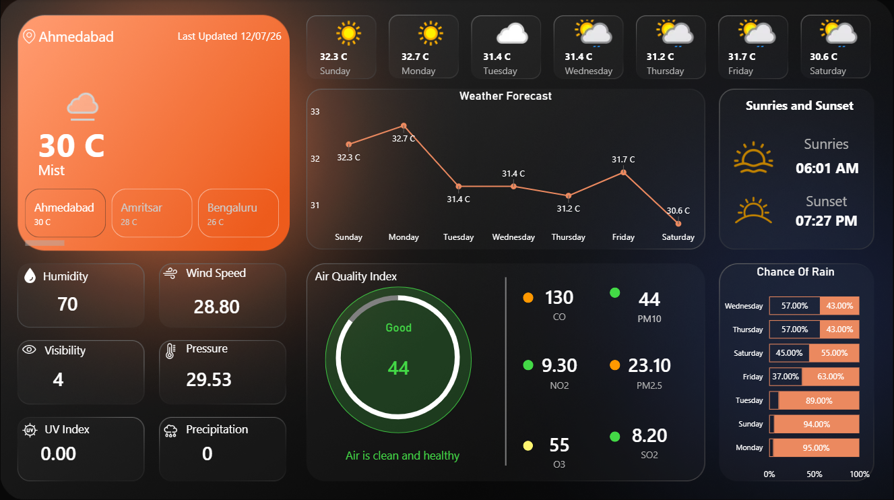
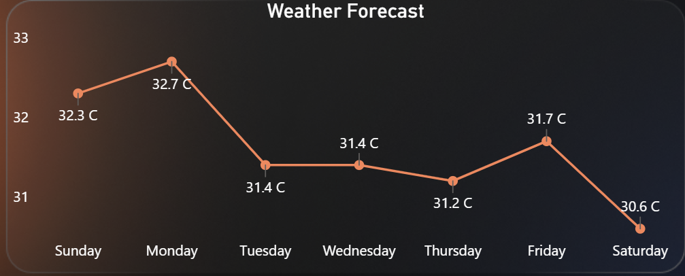
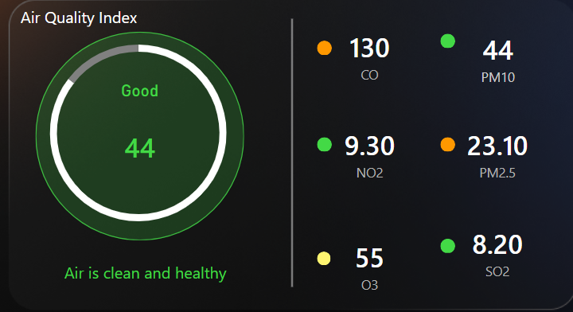

# 🌤️ India Weather Intelligence Dashboard
### Real-time Weather & AQI Monitoring | Power BI



---

## 📌 Overview
An interactive Power BI dashboard providing real-time 
weather intelligence for **19 major Indian cities** 
with **7-day forecast** and **Air Quality Index** monitoring.

---

## ✨ Key Features

| Feature | Details |
|---------|---------|
| 🌡️ Temperature Forecast | 7-day trend with line chart |
| 🌧️ Rain Probability | Daily precipitation chances |
| 💨 Wind & Humidity | Real-time atmospheric data |
| 🌅 Sunrise & Sunset | City-wise timings |
| 🏭 Air Quality Index | CO, PM2.5, PM10, NO2, O3, SO2 |
| 🏙️ City Coverage | 19 Major Indian Cities |
| ⚡ Auto Refresh | Daily data refresh via API |

---

## 🏙️ Cities Covered
Mumbai • Delhi • Bangalore • Chennai • Kolkata  
Hyderabad • Pune • Ahmedabad • Jaipur • Bhopal  
Amritsar • Indore • Jabalpur • Lucknow • Surat  
Nagpur • Patna • Chandigarh • Visakhapatnam

---

## 🛠️ Tech Stack

Data Source   → WeatherAPI (Free Tier)

ETL           → Power Query (M Language)

Data Fetch    → Power BI Web Connector (Direct URL)

Modeling      → Star Schema (Fact + Dimension tables)

Calculations  → DAX Measures

Visualization → Power BI Desktop

---

## 📊 Dashboard Sections

### 1. Current Weather Panel
- Real-time temperature, humidity, wind speed
- Visibility, pressure, UV index, precipitation
- Weather condition with dynamic icons

### 2. 7-Day Forecast
- Daily temperature trend (line chart)
- Day-wise forecast cards with icons
- Rain probability per day

### 3. Air Quality Index
- AQI gauge with health category
- Individual pollutant levels
- Health recommendations

### 4. Sunrise & Sunset
- City-wise sunrise/sunset timings

## 📸 Screenshots

### forecast chart


### AQI Section  


---

## 🔑 Key DAX Measures

```dax
-- AQI Status
Aqi_Status = 
SWITCH(TRUE(),
    [AQI Value] <= 50,  "Good",
    [AQI Value] <= 100, "Moderate",
    [AQI Value] <= 150, "Unhealthy for Sensitive",
    [AQI Value] <= 200, "Unhealthy",
    [AQI Value] <= 300, "Very Unhealthy",
    "Hazardous"
)

-- 7-Day Max Temperature
Max Forecast Temp = MAX('Forecast_Day'[Temperature])

-- Rain Alert Cities
Rain Alert Count = 
CALCULATE(
    DISTINCTCOUNT('Forecast_Day'[City]),
    'Forecast_Day'[Rain_Probability] > 70
)
```

---
## ⚙️ How to Run

### Prerequisites
- Power BI Desktop (Free)
- WeatherAPI.com Free Account

### Setup
1. Get free API key from [WeatherAPI.com](https://weatherapi.com)

2. Open `WeatherDashboard.pbix` in Power BI Desktop

3. Go to:
   Transform Data → Data Source Settings
   → Update API Key in URL

4. Refresh Data ✅

### API URL Used
```
http://api.weatherapi.com/v1/forecast.json
?key=YOUR_API_KEY
&q=Delhi
&days=7
&atp=yes
&alerts=no
```

## 👨‍💻 Author
**Mayank**  
B.Tech CSE (Data Science) | Oriental College of Technology, Bhopal
---

## 📝 License
MIT License — Free to use and modify
